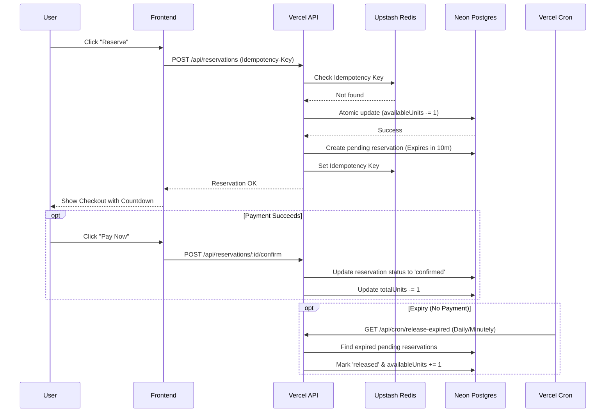

# Allo Health Inventory - Take-Home Exercise
**By: Ritam Pal**

This is a Next.js application that implements an inventory and order-fulfillment platform with a focus on concurrency control during the checkout process.

**Live Demo**: [https://allo-inventory-smoky.vercel.app](https://allo-inventory-smoky.vercel.app)
**GitHub Repo**: [https://github.com/ritam03/allo-inventory](https://github.com/ritam03/allo-inventory)

## Architecture & Concurrency Control

To prevent race conditions during inventory reservation and payment processing, this app uses a pessimistic locking strategy combined with atomic updates in PostgreSQL.

### Reservation Flow
1. **Reserve**: When a user clicks "Reserve", an API request is sent. The server performs an atomic decrement on `availableUnits` using a conditional update: `updateMany` where `availableUnits >= quantity`. This completely eliminates race conditions where multiple users try to reserve the last unit at the exact same millisecond. If successful, it creates a `pending` reservation with a 10-minute expiry.
2. **Confirm**: Upon payment success, an atomic update is performed to mark the `pending` reservation as `confirmed`. It also ensures the `expiresAt` hasn't passed. This prevents concurrent expirations from race-conditioning with payments. The `totalUnits` (representing physical stock) is decremented.
3. **Release**: If the user cancels or payment fails, the pending reservation is atomically marked as `released` and the `availableUnits` is incremented back.

### Idempotency
Idempotency is implemented using Redis (Upstash) to avoid duplicate reservations or side effects if the client retries requests. An `Idempotency-Key` header is sent with the reservation request. If the server sees the key, it returns the cached original response.

### Expiry Mechanism
Reservations that are not confirmed before `expiresAt` are automatically released by a **Vercel Cron Job**. 
- The cron job is configured in `vercel.json` to hit the `/api/cron/release-expired` endpoint every minute.
- It finds all pending reservations where `expiresAt < now()` and atomically releases them, restoring the stock.

## Tech Stack
- **Framework**: Next.js 15 (App Router)
- **Database**: PostgreSQL (hosted on Neon)
- **ORM**: Prisma (v5)
- **Caching/Idempotency**: Redis (hosted on Upstash)
- **Styling**: Tailwind CSS + shadcn/ui

## Getting Started

1. Clone the repository
2. Install dependencies: `npm install`
3. Ensure you have the environment variables set up in `.env` (these are provided in the repo for demo purposes, although normally they'd be secret).
4. Run migrations: `npx prisma db push`
5. Seed the database: `npx tsx scripts/seed.ts`
6. Run the dev server: `npm run dev`

## Trade-offs and Future Improvements
- **Expiry Mechanism Frequency**: Vercel's free tier limits cron jobs to once per day natively on free plan sometimes, but assuming pro tier it runs every minute. If 1-minute granularity is too slow, a background worker (like Inngest or Trigger.dev) or Redis TTL key-space notifications could be used for exact millisecond expirations.
- **Frontend Live Sync**: The frontend currently refreshes on user action, but an improvement would be using WebSockets or Server-Sent Events (SSE) to update the available stock in real-time for all connected clients.
- **Idempotency Scope**: Idempotency is only added to the reservation creation. It could be expanded to the confirm/release endpoints as well for complete fault tolerance.
